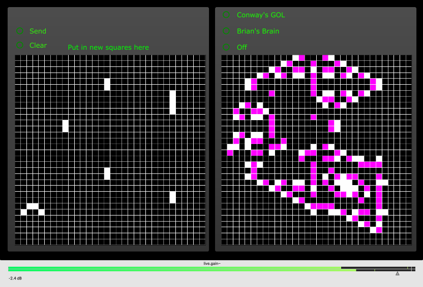

# Max 8 Cellular Automaton Granular Synth

A granular synth hooked up to Conway's Game of Life or Brian's Brain. Made in January 2021 for a university project.

# What is this?

Originally made for a university project, this is a Max8 patch that uses a cellular automaton to control a granular synthesizer.

The cellular automaton is based on Conway's Game of Life, but can also be set to Brian's Brain.

The JavaScript is used to draw the grid and iterate the cellular automaton it then sends the data to the granular synth.

Everything is made from scratch.

# How to use

Simply click on the cells to toggle them on or off.

The automaton will start running if you press send, or if you choose a different method of running the automaton.

You can change the DAC to be outlets instead to use in your own patches.
